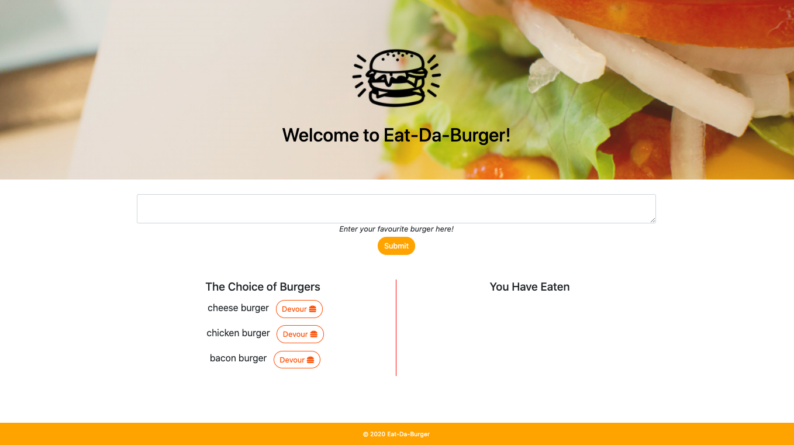

# Node Express Handlebars burger

## Description
This project is a burger logger with MySQL, Node, Express, Handlebars and orm. It follows the MVC design pattern; use Node and MySQL to query and route data in the application, and Handlebars to generate HTML.

### Heroku URL
[Click Here to checkout a deployed application](https://sheltered-mountain-51090.herokuapp.com/)

### Screenshots

## Table of Contents
- [Description](#description) 
- [Installation](#installation) 
- [Usage](#usage) 
- [Questions](#questions) 

## Installation
### Local application 
- Step 1: `npm install dotenv express express-handlebars mysql`
- Step 2: `node server.js` (app will run in localhost:8080)

### Heroku appliaction
- Step 1: In the input box type your favourite burger name
- Step 2: Once the name of submitted burger is in the list of the Choice of Burger Click `devour it` button to eat your burger
- Step 3: Then the burger will appear in the list You Have Eaten.

## Usage
In the `db` folder Use `schema.sql` and `seed.sql` to build a table in the database. Make sure to npm install listed on installation.

## License

- **[MIT License](https://opensource.org/licenses/MIT)** 
- 2020 Eat-Da-Burer

## Questions
| Ask me Now! |
| :---: |
|  |
| <a href="https://github.com/nuleeannajeon" target="_blank">Checkout Github Profile</a> |
